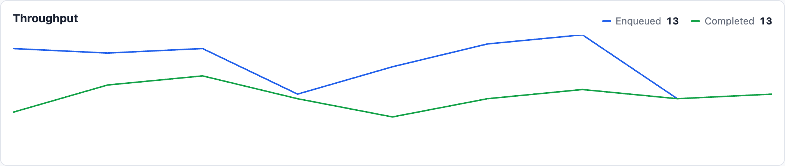

# Changelog

## 0.4.0

- Queues (home) page: a real-time **Throughput** line chart at the top, plotting jobs
  that became ready to run against jobs that finished, one point per poll interval.
  It tracks only what happens after the page loads (no history), keeps a rolling
  10-minute window scrolling right-to-left, and is fed by a small JSON `metrics`
  endpoint so the SVG state survives the auto-refresh swap.

  

## 0.3.0

- Recurring tasks page: **Run now** button to trigger a task outside its schedule
  (recorded as a run, so "Last run" reflects it), and tasks are now sorted by next
  run time instead of by key.
- Hovering a cron schedule shows a plain-English description of when it runs
  (e.g. `30 9 * * 1-5` → "At 09:30 on Monday through Friday").

## 0.2.0

- Queues page: new **Last enqueued** column showing when each queue last received a job.
- Queues with nothing enqueued in the last 30 days collapse into a one-click
  "Inactive queues" section. Configurable via `config.queue_activity_window`
  (`nil` shows everything in one table); paused queues always stay in the main table.
- The auto-refresh poller now preserves the open/closed state of collapsible sections
  across refreshes.

## 0.1.0

Initial release.

- Queues overview with per-queue ready count, latency, failed count, and pause/resume.
- Latency-SLA aware: `within_*` queue names (e.g. `within_5_minutes`) set their own
  warning threshold and sort order; configurable per queue or globally.
- Jobs browsing by status (ready, scheduled, in progress, blocked, failed, finished)
  with queue/class filters, keyset pagination, and a job detail page.
- Failed job management: retry/discard individually or in bulk.
- Workers page: supervisor tree, heartbeat freshness, stale detection, orphaned-job warning.
- Recurring tasks page with last/next run times.
- Zero-dependency UI served by the engine itself, with polling auto-refresh.
- Optional HTTP Basic auth via `JobBoard.configure`.
